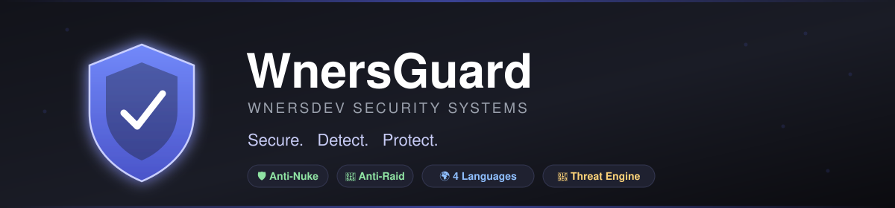
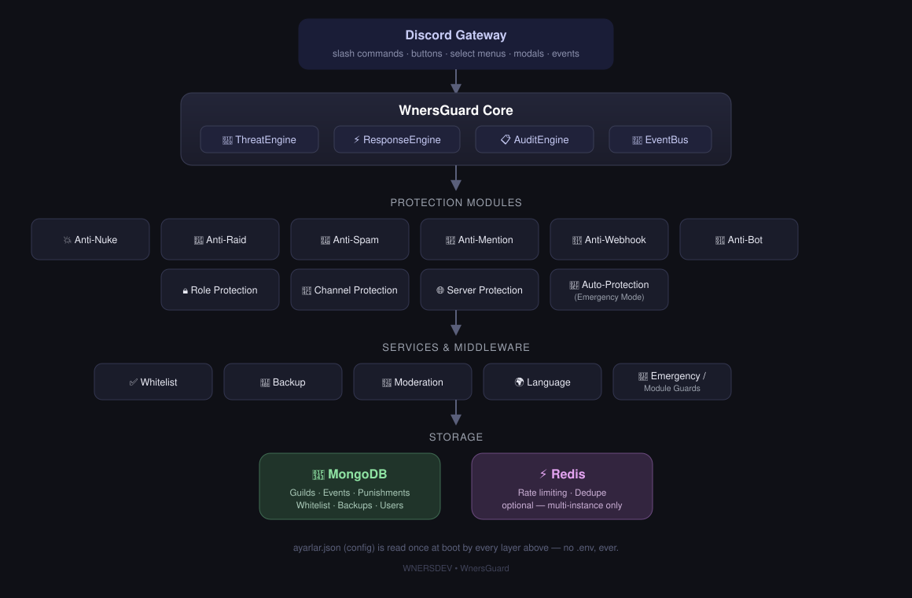

<div align="center">



<br/>


<br/>


<p align="center">
  <b>A modular, production-shaped Discord security platform.</b><br/>
  Anti-Nuke · Anti-Raid · Anti-Spam · Anti-Webhook · Anti-Bot · Anti-Mention · Role/Channel/Server Protection<br/>
  <sub>Built by <b>WNERSDEV</b> — Turkish-first commands, four languages, zero <code>.env</code> files.</sub>
</p>

</div>

<br/>

## Contents

- [What is this](#what-is-this)
- [Feature overview](#feature-overview)
- [Architecture](#architecture)
- [Installation](#installation)
- [Configuration — `ayarlar.json`, not `.env`](#configuration--ayarlarjson-not-env)
- [Commands](#commands)
- [Project structure](#project-structure)
- [Extending a protection module](#extending-a-protection-module)
- [Testing & CI](#testing--ci)
- [Security](#security)
- [Troubleshooting](#troubleshooting)

<br/>

## What is this

WnersGuard is a Discord bot that behaves like a small security product rather
than a moderation script: every risky event (a channel-deletion burst, a raid
of new accounts, a role quietly gaining Administrator) is turned into a
**threat score**, and the score — not a hardcoded `if` — decides whether the
bot logs it, alerts admins, blocks it, or (only under narrow, documented
conditions) takes a short, reversible automatic action.

It ships nine independent protection modules, a fully clickable in-Discord
Security Center, four-language support with Turkish as the default, canvas-
rendered incident reports, backup/restore, and an Emergency Mode that
actually tightens detection instead of just changing a label.

<br/>

## Feature overview

<table>
<tr><td width="33%" valign="top">

### 🛡️ Protection
- Anti-Nuke — mass channel/role delete-create bursts, dangerous role creation, webhook abuse
- Anti-Raid — join-burst + account-age + avatar scoring
- Anti-Spam — message bursts, duplicates, invite links, caps abuse
- Anti-Mention — `@everyone`/`@here` and mass mentions
- Anti-Webhook — webhook-authored message floods
- Anti-Bot — risky new-bot detection
- Role / Channel / Server Protection

</td><td width="33%" valign="top">

### 🧠 Core engine
- `ThreatEngine` — weighted 0–100 scoring
- `ResponseEngine` — score → log / alert / block / auto-protect
- `AuditEngine` — real-executor resolution, never a guess
- `AutoProtectionService` — 10-min reversible timeout, CRITICAL + Emergency Mode only
- Redis-backed rate limiting & dedupe (opt-in, in-memory by default)

</td><td width="33%" valign="top">

### 🎛️ Operator experience
- Clickable Security Center (buttons/selects/modals)
- Backup & **additive-only** restore, with confirmation
- Whitelist add/remove (users, roles, bots)
- Canvas incident cards & stat reports
- 4 languages, per-user + per-guild
- Config lives in one JSON file — no `.env`

</td></tr>
</table>

<br/>

## Architecture



Every layer talks to the one below it through a narrow interface: Discord
events become **signals**, signals become a **score**, a score becomes an
**action** — and every action is logged before it's ever executed.

<br/>

## Installation

```bash
git clone <your-fork-url> wnersguard
cd wnersguard
npm install

cp ayarlar.example.json ayarlar.json   # fill in DISCORD_TOKEN, CLIENT_ID, MONGODB_URI
npm run deploy-commands                 # registers slash commands with Discord
npm run dev                             # or: npm run build && npm start
```

| Command | What it does |
|---|---|
| `npm run dev` | Runs from `src/` with hot reload (`ts-node-dev`) |
| `npm run build` | Compiles to `dist/` and copies locale JSON alongside it |
| `npm start` | Runs the compiled bot (`node dist/wnerdev.js`) |
| `npm run deploy-commands` | Registers/updates slash commands globally |
| `npm test` | Runs the Vitest suite (Redis/Mongo integration tests auto-skip without a live service) |
| `npm run lint` | ESLint over `src/**/*.ts` |

Need MongoDB and Redis locally for integration testing? `docker compose up -d`
(see [`docker-compose.yml`](./docker-compose.yml)) brings up both.

<br/>

## Configuration — `ayarlar.json`, not `.env`

This project intentionally has **no dotenv, no `.env` file, anywhere.**
Every setting — including the bot token — lives in one plain JSON file at
the project root:

```json
{
  "DISCORD_TOKEN": "",
  "CLIENT_ID": "",
  "MONGODB_URI": "",
  "REDIS_URL": "",
  "NODE_ENV": "development",
  "LOG_LEVEL": "info"
}
```

| File | Tracked in git? | Purpose |
|---|---|---|
| `ayarlar.example.json` | ✅ yes | Empty template — copy this to get started |
| `ayarlar.json` | ❌ no (gitignored) | Your real credentials — never committed |
| `ayarlar.test.json` | ✅ yes | Dummy values only, loaded automatically when `NODE_ENV=test` |

`src/config/env.ts` reads and Zod-validates this file at boot. A real
process environment variable (e.g. a CI service container's own env) can
still override a value if one happens to be set — that's a plain `process.env`
read, not a `.env` file load, so it doesn't reintroduce dotenv.

| Key | Required | Notes |
|---|---|---|
| `DISCORD_TOKEN` | ✅ | Bot token from the Discord Developer Portal |
| `CLIENT_ID` | ✅ | Application (client) ID — used for command registration |
| `MONGODB_URI` | ✅ | Any MongoDB connection string (Atlas or self-hosted) |
| `REDIS_URL` | — | Leave `""` for a single instance. Set it to share rate-limiting/dedupe state across multiple bot processes |
| `NODE_ENV` | — | `development` (default) · `production` · `test` |
| `LOG_LEVEL` | — | Pino level, default `info` |

**Discord permissions/intents:** `Guilds`, `GuildMembers`, `GuildMessages`,
`GuildModeration`, `GuildWebhooks`, `MessageContent` — enable **Server
Members** and **Message Content** as privileged intents in the Developer
Portal. Recommended bot permissions: Manage Channels/Roles/Webhooks,
Kick/Ban Members, Moderate Members, View Audit Log.

<br/>

## Commands

<table>
<tr><th>Category</th><th>Commands</th></tr>
<tr><td valign="top">🛡️ <b>security/</b></td><td>

`/guvenlik` Security Center · `/koruma` toggle protection modules · `/loglar` recent security events · `/acil-durum` Emergency Mode · `/yedek olustur|listele|geri-yukle` backup & restore

</td></tr>
<tr><td valign="top">🔨 <b>moderation/</b></td><td>

`/uyar` warn · `/sustur` timeout · `/at` kick · `/yasakla` ban · `/kullanici` per-user security profile

</td></tr>
<tr><td valign="top">⚙️ <b>settings/</b></td><td>

`/ayarlar log-kanali|alert-kanali|goster` · `/dil` language picker

</td></tr>
<tr><td valign="top">💬 <b>general/</b></td><td>

`/yardim` command list

</td></tr>
</table>

All command names are Turkish-first by design; every reply is fully
localized (tr/en/de/es) based on the user's language pick, falling back to
the guild's default, falling back to Turkish.

<br/>

## Project structure

```
src/
├── commands/
│   ├── security/      /guvenlik, /koruma, /loglar, /acil-durum, /yedek
│   ├── moderation/     /uyar, /sustur, /at, /yasakla, /kullanici
│   ├── settings/       /ayarlar, /dil
│   └── general/        /yardim
├── security/          AntiNuke, AntiRaid, AntiSpam, ... one module per protection
├── engines/            ThreatEngine, ResponseEngine, AuditEngine, EventBus
├── components/         buttons / selectMenus / modals handlers
├── database/           MongoDB + Redis connections (Redis optional)
├── models/             Mongoose schemas
├── services/           Whitelist, Backup, Moderation, Language, Command/Component registries
├── middleware/          emergencyGuard, moduleGuard — cached guild-flag checks
├── events/             Gateway event wiring
├── canvas/             Security report / threat card PNG renderers
├── localization/       tr/en/de/es JSON dictionaries + t() loader
├── config/             ayarlar.json validation (Zod), brand + threat constants
└── wnerdev.ts          bootstrap (the entry point)
```

`commands/` is grouped by domain, not one folder per command —
`CommandRegistry.loadCommands()` loads every file under every subfolder
automatically, so the grouping above is purely for humans reading the code.

<br/>

## Extending a protection module

Every module — new or existing — follows the same three-step shape:

```ts
// 1. Gather signals from a Discord event
const signals: ThreatSignal[] = [];
if (somethingLooksWrong) signals.push({ reason: "...", weight: 40 });

// 2. Let ThreatEngine turn signals into a score + severity
const { score, severity, reasons } = ThreatEngine.score(signals);

// 3. Let ResponseEngine decide (and log/alert/block) the action
await ResponseEngine.handle(guild, severity, {
  guildId: guild.id,
  type: "myModule.something",
  executorId,
  targetId,
  riskScore: score,
  severity,
  action: "LOGGED", // ResponseEngine overwrites this based on severity
  metadata: { reasons },
});
```

`AntiNukeModule` and `AntiRaidModule` are the fullest reference
implementations — copy their whitelist-check and module-toggle patterns
(`WhitelistService`, `middleware/moduleGuard.ts`) for a new module.

<br/>

## Testing & CI

```bash
npm test              # unit tests — always run, no external services needed
docker compose up -d  # optional: real Redis + MongoDB for integration tests
npm test               # now also exercises RedisRateLimiter.integration.test.ts
                        # and MongoDb.integration.test.ts against the real thing
```

`.github/workflows/ci.yml` runs lint → test → build on every push/PR, with
live Redis **and** MongoDB service containers so the integration tests run
for real on every CI pass, not just the in-memory fallback path.

<br/>

## Security

[`SECURITY_AUDIT.md`](./SECURITY_AUDIT.md) is a self-audit against a
standard security checklist (permission bypass, injection, rate-limit
bypass, secret exposure, dangerous automatic actions, and more) — it states
what's covered, where in the code, and what's an honestly-tracked open gap
rather than asserting "done" and moving on.

<br/>

## Troubleshooting

- **Commands not showing up** — re-run `npm run deploy-commands`; global
  command propagation can take up to an hour.
- **"MongoDB disconnected" in logs** — the bot keeps running in degraded
  mode (events logged, not persisted) and retries every 5s. Check
  `MONGODB_URI` in `ayarlar.json`.
- **A translation shows up as a dotted key** (e.g. `security.center.title`)
  — that key is missing from one of the four locale JSON files under
  `src/localization/<lang>/`.
- **Full build history and phase-by-phase notes** live in
  [`CHANGELOG.md`](./CHANGELOG.md).

<br/>

<div align="center">

🛡️ <b>WNERSDEV · WnersGuard</b><br/>
<sub>Secure. Detect. Protect.</sub>

</div>
